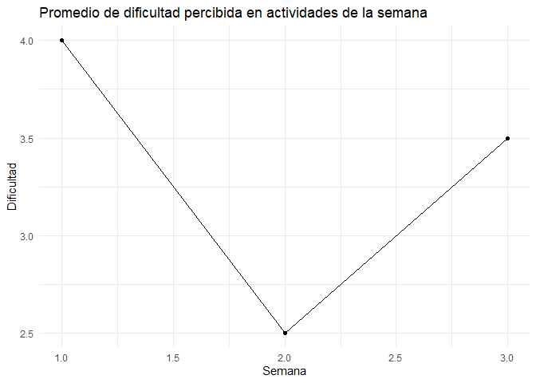

Encuesta de Carga Académica
================

# Horas por semana

### Promedio de horas dedicadas al curso

<!-- -->

# Horas por actividad y semana

### Promedio de horas dedicadas al curso

<!-- -->

# Dificultad percibida por semana

### Promedio de dificultad

<!-- -->

# Vista individual

### Horas por actividad

<!-- -->

### Horas totales

<!-- -->

### Dificultad

<!-- -->
